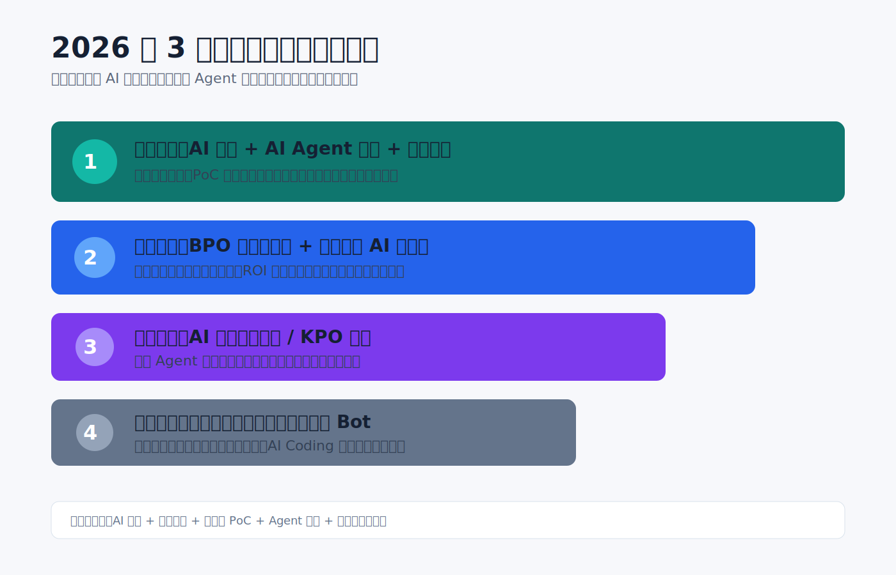
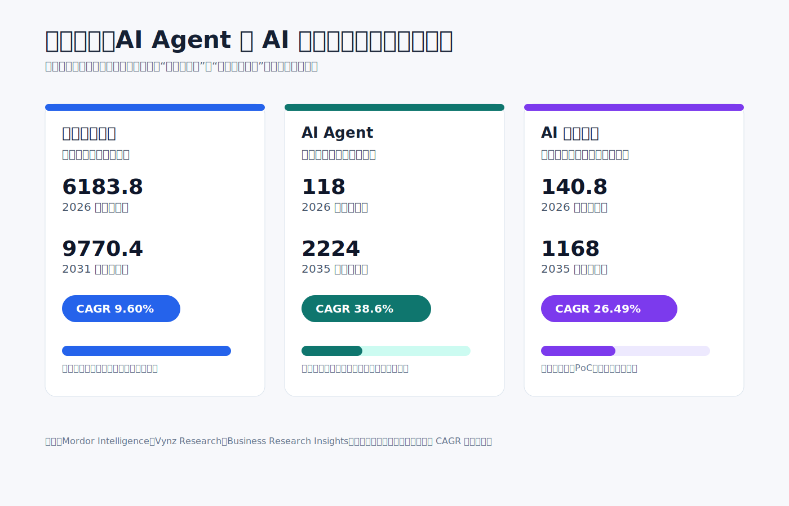
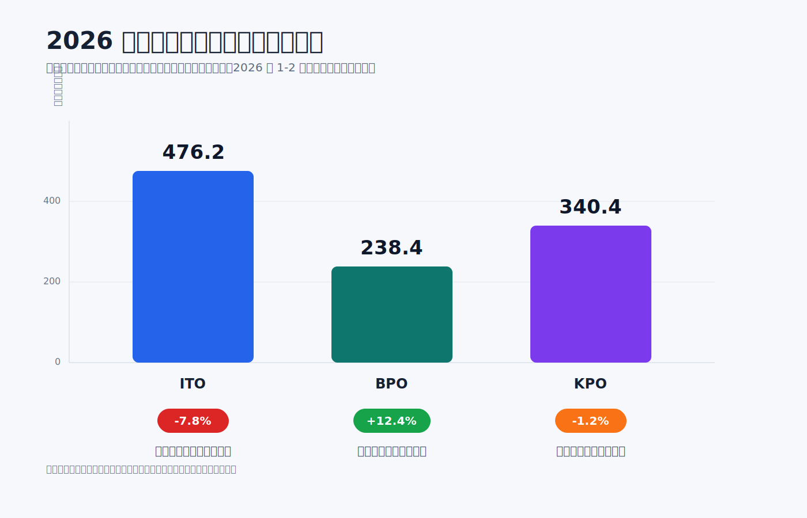
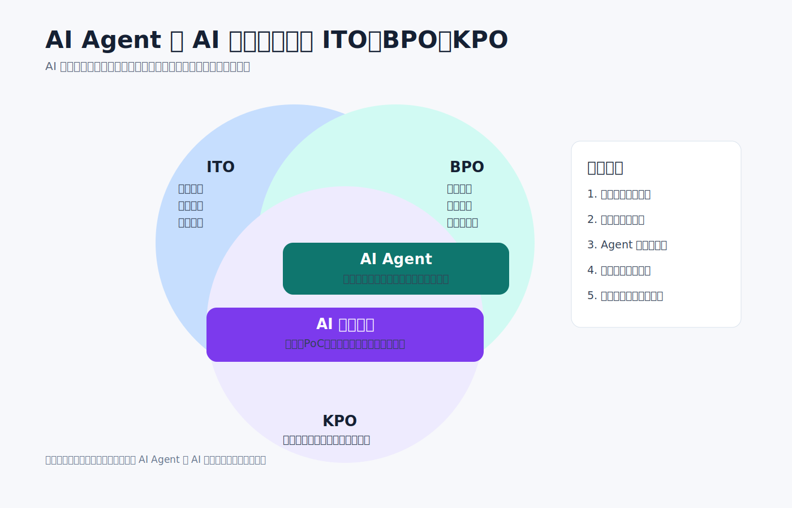
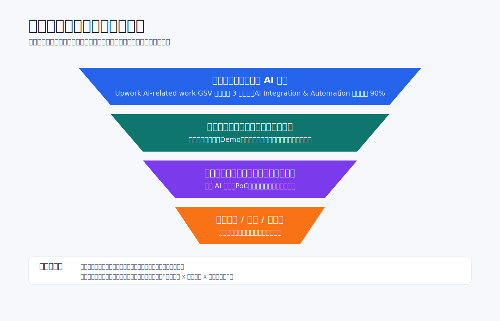
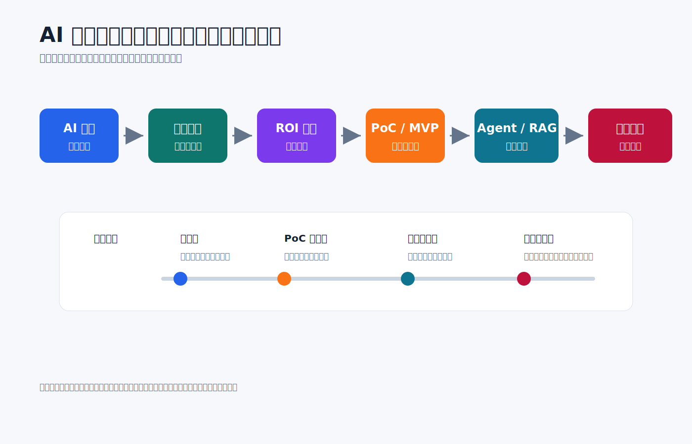
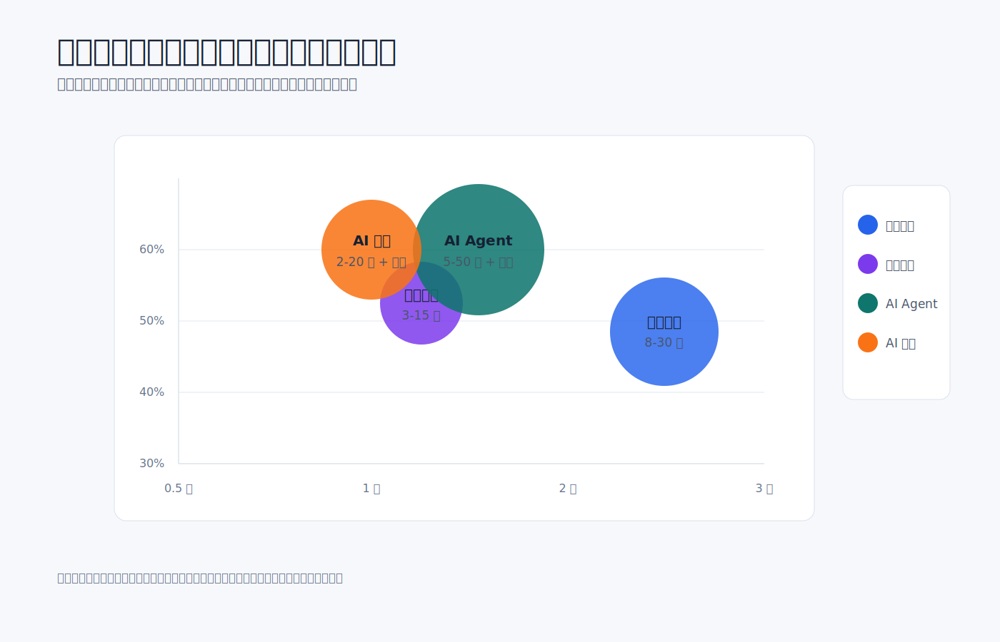
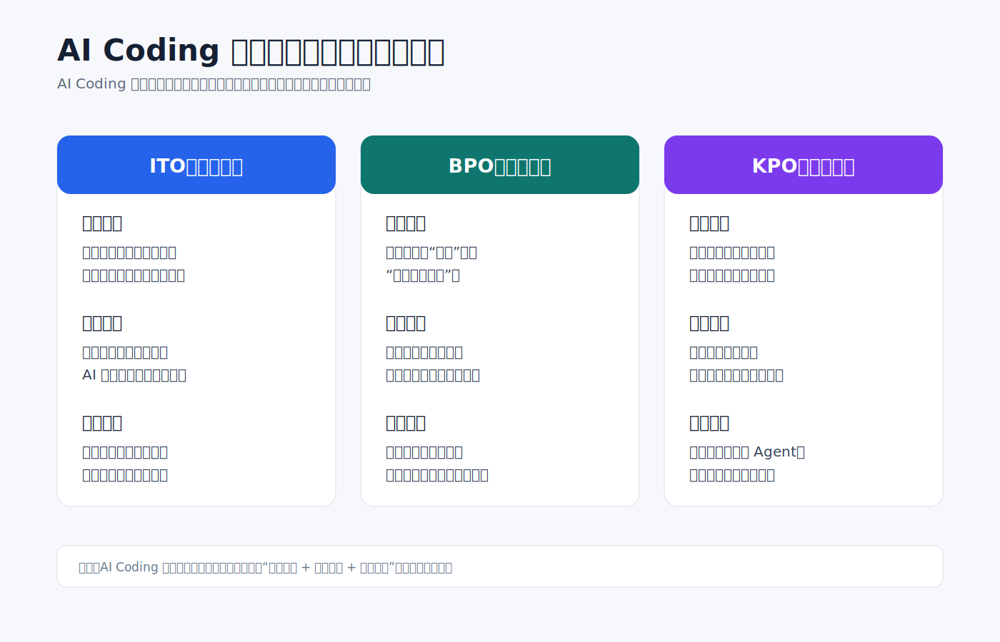
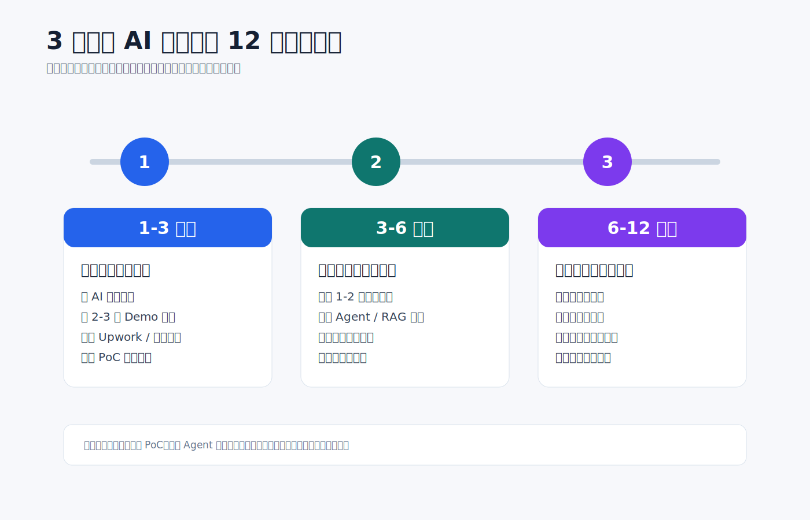

# 2026 年软件开发与 AI Agent 外包及咨询市场分析报告

**日期：** 2026 年 4 月 28 日

**团队：** 3 人技术创业团队

**定位：** 聚焦软件开发与 AI Agent 领域的外包接单与咨询服务

***

## 摘要

本报告的核心判断是：**2026 年最大的机会不在纯软件外包，也不在单独卖 AI 概念咨询，而在“AI 咨询 + AI Agent 实施 + 持续运营”的组合型服务。** 纯软件开发外包仍是最大基本盘，但增长较稳；AI Agent 和 AI 咨询服务规模较小，却代表新增预算和高增长采购需求。

从核心数据看，三类市场的机会层级非常清晰：

* **软件开发外包是基本盘，但不是最大增量。** Mordor Intelligence 估算，全球软件开发外包市场 2026 年约为 6183.8 亿美元，2031 年约为 9770.4 亿美元，2026-2031 年 CAGR 约 9.60% [\[2\]](https://www.mordorintelligence.com/industry-reports/software-development-outsourcing-market)。这说明市场足够大，但通用开发、基础编码和人天外包会持续承压。

* **AI Agent 是增长最快的技术交付方向。** Vynz Research 估算，全球 AI Agents 市场 2025 年约 77 亿美元、2026 年约 118 亿美元、2035 年约 2224 亿美元，2026-2035 年 CAGR 约 38.6% [\[3\]](https://www.vynzresearch.com/ict-media/ai-agent-market)。这类需求最适合小团队做知识库问答、流程自动化、客服/销售辅助、内部工具编排等单场景项目。

* **AI 咨询服务是最适合作为入口的高价值服务。** Business Research Insights 估算，全球 AI Consulting Services 市场 2026 年约为 140.8 亿美元，2035 年约为 1168 亿美元，2026-2035 年 CAGR 约 26.49% [\[16\]](https://www.businessresearchinsights.com/market-reports/ai-consulting-services-market-119843)。真正有价值的不是单独卖战略报告，而是把 AI 诊断、场景筛选、PoC、系统集成、上线培训和托管运营打包交付。

* **平台需求已经验证海外增量。** Upwork 官方 2025 年 Q4 财报披露，AI-related work 的 GSV 年化已超过 3 亿美元，同比超过 50%；AI Integration & Automation work 同比增长超过 90% [\[4\]](https://investors.upwork.com/news-releases/news-release-details/upwork-reports-fourth-quarter-and-full-year-2025-financial)。这说明客户已经在为 AI 自动化、RAG、内部工具和数据流程类项目付费。

* **CDP 抓取进一步验证公开岗位 / 服务供给强度。** 本报告在 2026-05-02 使用 Chrome CDP 复用真实浏览器状态，抓取 7 个渠道、59 个关键词 / 分类页面，其中 32 条取得公开数量并保存截图证据。Upwork 的 AI automation、AI agent、workflow automation、API integration 等关键词均有数百到数千级公开项目；Fiverr 的 AI automation、AI agent、AI Development、chatbot 等公开服务结果达到数千到 2 万+；Wellfound 和 LinkedIn 也显示 AI / automation / data 相关岗位有明显招聘信号。完整明细见附件 A。

* **X 社媒采集补充验证“赚钱路径”而不是平台岗位数。** 本报告在 2026-05-03 使用 Chrome CDP 低频采集 X Top 搜索页，围绕 `AI automation`、`AI SaaS`、`AI newsletter`、`AI templates`、`AI SEO`、`AI side hustle` 等商业化分享主题，合并去重得到 65 条候选帖子。结果显示，最接近真实变现的方向不是泛泛的“AI 副业”，而是 AI 自动化服务、垂直微型 SaaS / AI App、内容产品和 AI SEO / 独立站；其中 AI 自动化服务的业务场景、客户流程和交付边界最清晰。完整分析见附件 E。

因此，机会优先级应当直接排序为：

1. **优先做：AI 咨询 + Agent PoC + 后续实施。** 用诊断包切入客户，用 PoC 验证价值，再转成知识库 Agent、流程自动化 Agent、内部协作 Agent 和月度维护。
2. **重点做：存量业务系统 AI 化改造。** 客户已有系统、已有数据、已有流程，项目更容易验收，也更容易做维护续费。
3. **谨慎做：纯软件开发和纯人天外包。** 规模大但竞争激烈，AI Coding 会进一步压低标准化开发溢价。
4. **避免做：脱离业务流程的通用聊天机器人。** 演示效果容易做，但续约和复购弱，难以形成持续利润。

对 3 人团队而言，最值得包装的服务不是“我们会做 AI”，而是 `AI 诊断 + 单场景 PoC + Agent 实施 + 月度托管优化`。这个组合同时踩中 AI 咨询的高信任入口、AI Agent 的高增长需求，以及企业持续运营的续费空间。

**图 1：2026 年 3 人团队技术外包机会排序**

***

## 1. 市场规模与增长分析

2026 年技术外包市场的核心变化，不是传统业务被完全替代，而是传统业务仍在提供底盘，新兴业务则在重塑价值分配。软件开发外包和 AI Agent 外包并不是彼此独立的两条赛道，而是越来越多地在同一个项目中交叉出现：一个知识库问答系统既是软件开发项目，也是 AI Agent 项目；一个流程自动化系统既包含接口开发，也包含工作流编排、模型调用和权限控制。

### 1.1 市场规模数据

#### 1.1.1 全球市场

从可核验的数据看，全球市场已经呈现出明显分化：

* **软件开发外包：** Mordor Intelligence 估算，2026 年全球软件开发外包市场约为 6183.8 亿美元，2031 年约为 9770.4 亿美元，复合增长率约 9.60% [\[2\]](https://www.mordorintelligence.com/industry-reports/software-development-outsourcing-market)。这一数字足以说明软件开发外包仍是市场基本盘，但也意味着增长正在回归理性区间。对小团队而言，这一板块的机会主要集中在 AI 原生应用开发、业务工具改造与中小企业定制场景，而不是低附加值的标准化开发任务。

* **AI Agent 外包：** 当前更适合采用研究机构的趋势口径，而不是直接采用传播性更强的夸张市场数字。Vynz Research 给出的全球 AI Agents 市场口径为：2025 年约 77 亿美元，2026 年约 118 亿美元，2035 年约 2224 亿美元，复合增长率约 38.6% [\[3\]](https://www.vynzresearch.com/ict-media/ai-agent-market)。这一口径虽然无法直接用于本地接单规模测算，但足以说明 AI Agent 已经从概念验证进入持续扩张阶段。

* **AI 咨询服务：** 如果只把 AI 咨询理解为战略报告和培训，其规模会被低估；当前更贴近成交现实的口径，是把场景诊断、路线图、PoC、系统集成、Agent 落地、治理与托管运营一起纳入“咨询 + 实施”专业服务。Business Research Insights 估算，全球 AI Consulting Services 市场 2026 年约为 140.8 亿美元，2035 年约为 1168 亿美元，复合增长率约 26.49% [\[16\]](https://www.businessresearchinsights.com/market-reports/ai-consulting-services-market-119843)。这个口径不应直接等同于软件订阅或云算力收入，但可以作为企业为 AI 落地支付专业服务费用的参考。

**图 2：软件外包、AI Agent 与 AI 咨询市场规模及增速对比**

#### 1.1.2 中国市场

对于本地团队而言，中国市场比全球总盘子更具有直接意义，但这部分需要更谨慎地处理数据口径。

从可公开核验的商务部口径看，2025 年我国服务外包产业整体仍保持较大规模，其中离岸信息技术外包（ITO）执行额 4627.5 亿元，同比下降 0.6%；离岸业务流程外包（BPO）执行额 2052.6 亿元，同比增长 10.5%；离岸知识流程外包（KPO）执行额 5008.7 亿元，同比下降 2.0% [\[12\]](https://tradeinservices.mofcom.gov.cn/article/lingyu/fwwbao/202601/181536.html)。

如果把 2025 全年作为结构参考，可以看到中国服务外包仍然以 ITO 作为技术外包基本盘，但 BPO 的增长更能反映流程型服务需求的扩张，而 KPO 仍保持高体量，说明知识密集型与研发型服务依然是中国市场的重要组成部分。这对小团队的启发是，单纯出售通用开发工时会越来越难建立优势，更有机会的方向仍然是围绕流程、知识和运营效率交付更高附加值的解决方案。

从最新月度走势看，2026 年 1-2 月我国企业承接服务外包合同额 2132.8 亿元，执行额 1747.7 亿元，同比分别下降 8.7% 和 6.0%；其中离岸服务外包合同额 1277.8 亿元，执行额 1055.0 亿元，同比分别下降 5.7% 和 1.7%。细分来看，离岸 ITO 执行额 476.2 亿元，同比下降 7.8%；BPO 执行额 238.4 亿元，同比增长 12.4%；KPO 执行额 340.4 亿元，同比下降 1.2% [\[1\]](https://tradeinservices.mofcom.gov.cn/article/lingyu/fwwbao/202603/182371.html)。这说明 2026 年初的变化并不是市场逻辑突然反转，而是 ITO 继续承压，BPO 保持韧性，KPO 高位波动。对小团队而言，更稳妥的判断仍然是：中国市场的机会更集中在金融、制造、贸易、政务等高流程密度、高知识密度行业中的定制开发、流程自动化与 AI Agent 场景。

对中国本地 AI 咨询市场，更合理的判断不是先追求一个单独的“咨询市场总额”，而是看企业 AI 投入从模型、云资源和软件订阅向落地服务传导。Grand View Research 估算，全球生成式 AI 市场 2025 年约为 222.1 亿美元，2033 年约为 3246.8 亿美元，2026-2033 年复合增长率约 40.8%，其中服务板块预计是预测期内增长最快的组成部分 [\[17\]](https://www.grandviewresearch.com/industry-analysis/generative-ai-market-report)。这意味着企业买完模型能力后，仍需要外部团队解决数据接入、流程改造、权限审计、员工培训和效果评估问题，这部分才是 AI 咨询服务最现实的需求来源。

**图 3：2026 年初中国离岸服务外包结构分化**

### 1.2 市场增长预测

2026-2031 年，核心业务板块的增长趋势预计仍将延续分化，但分化的关键，不在于谁完全取代谁，而在于价值中心的转移：

* 软件开发外包仍将持续增长，但新增价值将更多来自 AI 原生应用、系统改造、流程工具和更高复用度的行业解决方案，而不是单纯的编码工时。

* AI Agent 外包将是未来几年最值得重点布局的方向之一，但其增长并不意味着所有 Agent 项目都高利润。真正具有持续商业价值的项目，通常具备明确场景、稳定输入、可设计的人工兜底和持续运营空间。换句话说，未来增长最快的不是“一个万能智能体”，而是“很多个可验证、可集成、可审计的业务智能体”。

* AI 咨询服务会从“卖认知差”和“卖培训课”转向“卖落地路径”。Accenture 披露，其 2025 财年生成式 AI 收入达到 27 亿美元，生成式 AI 新签订单达到 59 亿美元，且这些数字不包含传统数据、经典 AI 或交付过程中使用 AI 的收入 [\[18\]](https://www.accenture.com/lu-en/about/company/integrated-reporting-financial)。这说明企业客户已经愿意为生成式 AI 的咨询、实施和规模化部署单独付费。对小团队而言，增长机会不在泛泛讲 AI，而在帮助客户把 AI 嵌入具体流程，并持续证明节省成本、提升效率或增加收入。

### 1.3 市场核心组成

技术外包市场目前可归纳为软件开发外包、AI Agent 外包和 AI 咨询服务三类核心板块，各板块对应不同的价值密度、交付方式与客户预期。对小团队而言，真正重要的不是知道每个板块的抽象定义，而是明确自己应该在哪个环节切入、在哪个环节避免陷入低价竞争。

#### 1.3.1 核心业务板块细分

* **软件开发外包（ITO 核心范畴）：** 仍是技术外包市场中规模最大的板块，覆盖 Web 应用、移动应用、企业级系统、接口集成、运维工具和业务后台等典型场景。它的核心变化是标准化模块持续被压价，而具有业务语境、系统集成和流程改造属性的项目仍有较强需求。对小团队更有价值的切入点，不是通用开发，而是 AI 原生 MVP、业务系统局部改造和垂直场景的定制模块。

* **AI Agent 外包（ITO/BPO/KPO 融合范畴）：** 是当前增长最快、也是最容易被市场叙事放大的板块。它实际覆盖了知识库问答、流程自动化、工具编排、内部协作、数据分析辅助、客服与销售辅助、审核与预处理等一系列任务。它与传统聊天机器人最大的区别，在于其目标不是“回答问题”，而是“完成任务”，因此往往需要连接业务系统、权限体系、知识库、日志和人工审批流程。

* **AI 咨询服务（KPO/ITO/BPO 融合范畴）：** 其本质不是单独写一份战略报告，而是帮助客户完成“识别场景、验证价值、上线系统、建立治理、持续优化”的闭环。它前端更像 KPO，需要行业理解、流程诊断和 ROI 评估；中段更像 ITO，需要 RAG、Agent、接口和权限集成；后端更像 BPO，需要知识库更新、日志巡检、提示词和流程调优。因此，AI 咨询服务的高价值部分，往往会自然延伸成实施费、维护费和托管运营费。

**图 4：AI Agent 与 AI 咨询如何横跨 ITO、BPO、KPO**

#### 1.3.2 外包类型定义与边界

为了更清晰地界定业务边界，可继续沿用 ITO、BPO、KPO 的划分框架：

* **信息技术外包（ITO）：** 核心是技术能力外包，包括软件开发、系统维护、接口开发、部署支持等。

* **业务流程外包（BPO）：** 核心是流程执行外包，包括客服流程、线索处理、工单流转、审批预处理、运营自动化等。

* **知识流程外包（KPO）：** 核心是认知和分析能力外包，包括行业研究、模型解释、知识整理、辅助决策等。

在 AI Agent 项目中，这三类边界往往是重叠的。一个销售线索 Agent 既涉及系统开发，也涉及业务流程自动化；一个投标辅助 Agent 既涉及文档检索，也涉及知识抽取与结构化输出。因此，AI Agent 的商业价值恰恰来自于这种跨分类整合能力。

***

## 2. 接单渠道与盈利占比分析

2026 年技术外包的接单渠道，已经不再只是“平台接单”与“熟人介绍”的简单二分，而是呈现出平台增量、私域沉淀、内容建立信任、线下完成转化的复合结构。不同渠道的价值，并不只体现在是否有订单，更体现在订单质量、沟通成本、交付边界和后续复购上。

### 2.1 主流接单渠道分类

#### 2.1.1 国际竞标制平台（Upwork Jobs、Upwork Project Catalog）

竞标制平台的核心特点，是客户先发布需求，服务方再通过 proposal、portfolio、资历和报价去争夺订单。对小团队而言，这类平台最适合测试英文市场、验证服务包、积累海外案例，也更适合承接边界清晰的自动化、RAG、内部工具和 MVP 项目。

从可核验的数据看，Upwork 是这部分最值得参考的平台。Upwork 官方披露，2025 年全年收入 7.878 亿美元，Q4 收入 1.984 亿美元；Q4 2025 的 GSV per active client 为 5129 美元；AI-related work 的 GSV 年化已经超过 3 亿美元，同比超过 50%；AI Integration & Automation work 同比增长超过 90%，Generative AI & Creative Production 同比增长 50% [\[4\]](https://investors.upwork.com/news-releases/news-release-details/upwork-reports-fourth-quarter-and-full-year-2025-financial)。这说明海外客户对 AI 自动化、工作流、内部工具和内容生成辅助的需求，已经从尝试阶段进入持续采购阶段。

平台规则方面，原始报告中的旧阶梯抽成规则已经不再适合作为当前口径。当前更应采用 Upwork 官方帮助中心披露的规则：freelancer service fee 为 0%-15%/contract，并在合约开始后锁定 [\[5\]](https://support.upwork.com/hc/en-us/articles/211062538-Learn-about-the-Freelancer-Service-Fee)。这意味着团队在报价时需要把平台费率、沟通成本和返工风险一起算进去，而不是只按开发工时估算利润。

对小团队而言，适合在国际平台上优先测试的项目通常包括：

* AI workflow automation；
* chatbot / knowledge base / RAG；
* internal tools / scripts / API integration；
* proof-of-concept 与 MVP。

在客单价层面，Upwork 的官方口径更偏“客户年化支出”而不是“单项目客单价”，但依然可以帮助判断采购能力。与此同时，Upwork 的 chatbot developer hiring guide 给出了更稳的价格带：Chatbot Developers 通常为 30-61 美元/小时，小型项目常见区间为 1000-5000 美元，中型项目常见区间为 1 万到 4 万美元，大型项目则可能达到 4 万到 15 万美元以上 [\[6\]](https://www.upwork.com/hire/chatbot-developers/)。再结合本报告对公开服务列表页的抽样观察，当前 AI / chatbot 服务的起报价中位数约在 99 美元附近，起报价均值约 131 美元。这些列表价不能等同于真实成交价，但能说明 Upwork 的轻量切入项目仍以数百美元到低千美元区间最容易起单，而中高复杂度项目则更多依赖定制沟通和多轮报价。

#### 2.1.2 国际套餐制平台（Fiverr Gigs）

套餐制平台的核心特点，是先卖标准化产品，再做增购和定制。与 Upwork 相比，Fiverr 更适合销售边界更清晰、可做分层套餐的服务，例如 FAQ Bot、RAG 小型部署、客服自动化、提示词优化、轻量 Agent 集成和 AI 咨询。

从平台规模与客群质量来看，Fiverr 官方披露，2025 年底 annual spend per buyer 达到 342 美元，同比提升 13.3% [\[7\]](https://investors.fiverr.com/news-releases/news-release-details/fiverr-announces-fourth-quarter-and-full-year-2025-results)。这说明 Fiverr 的整体客群仍以中小单为主，但客单价正在向更高复杂度项目上移。与此同时，Fiverr 在 2025 年春季商业趋势指数新闻稿中披露，AI Agent 相关 freelancer searches 在过去六个月增长了 18347% [\[8\]](https://investors.fiverr.com/news-releases/news-release-details/businesses-rush-harness-ai-agents-fueling-18347-surge-freelancer)。这个数字更适合作为搜索需求变化的信号，而不能直接等同于成交量或订单占比。

在客单价层面，Fiverr 的公开资料反而比 Upwork 更细。其 2026 成本指南给出了几组可直接引用的口径 [\[9\]](https://www.fiverr.com/resources/guides/costs/chatbot-developer)[\[10\]](https://www.fiverr.com/resources/guides/costs/ai-expert)。

* chatbot development 的固定价项目区间约为 45-520 美元；
* AI chatbot fixed-price projects 在 chatbot developer 成本页中的平均值约为 216 美元；
* AI agent development fixed-price projects 的平均值约为 295 美元；
* custom GPT application 的平均值约为 341 美元；
* 在 AI expert 汇总页中，AI chatbot development 的平均固定价又被给到约 520 美元。

这组数据说明 Fiverr 上的 AI 类服务并不存在单一客单价，而是强烈受分类边界、卖家定位和交付复杂度影响。对“AI chatbot”这个词，平台不同成本页给出的均值并不一致，说明有的口径偏轻量套餐，有的口径偏定制开发。为了补足中位数信息，本版额外基于公开列表页做了小样本抽样观察：AI chatbot 服务起报价样本中位数约 85 美元，样本均值约 146 美元；custom AI agent 服务起报价样本中位数约 81 美元，样本均值约 162 美元；RAG 相关服务起报价样本中位数约 90 美元，样本均值约 97 美元。需要强调的是，这些仍然是“起报价样本”，不是最终成交价。

#### 2.1.3 国内派单与整包平台（程序员客栈、开源众包等）

国内平台的核心价值，不在于能提供最优利润率，而在于它们更适合作为本地项目试点和需求观察的入口。其典型优势是沟通成本低、响应快、客户对本地服务更有信任感，特别适合承接轻量开发、流程自动化和中小企业内部工具类项目。

对 3 人团队而言，这类平台更适合作为：

* 早期案例积累渠道；
* 验证客户需求的样本池；
* 形成本地转介绍的跳板；
* 筛选未来可转为长期维护项目的客户来源。

国内平台的公开数据不如海外平台充分，尤其缺少可直接引用的平均客单价和中位数客单价。以程序员客栈为例，平台帮助中心公开的是报价机制和交易流程，而不是项目均价：平台说明整包项目由项目经理根据功能点进行报价，报价以开发者纯人力成本为基础；同时平台还公开了 `1980 梳理需求` 这类前置服务入口 [\[11\]](https://support.proginn.com/qa/)。由于缺少官方客单价分布，本版只能给出替代观察口径：基于公开 AI / 系统开发者页面的小样本抽样观察，开发者日报价样本中位数约为 800 元/日，均值约为 778 元/日。这并不是项目客单价，但可以帮助判断平台供给侧的基础报价带。

它们的局限也很明显：标准化需求较多，价格竞争显著，客户对“项目结果”和“维护边界”的定义往往不够成熟。因此，小团队不宜长期依赖这类平台作为核心增长来源，而应把平台项目尽量转化为更明确的维护合同、增购需求或私域关系。

#### 2.1.4 私域转介绍与老客户复购

私域渠道的核心价值，在于它通常对应更高信任度和更长生命周期，而不是更高流量。与平台订单相比，私域项目的真正优势不在“第一单价格”，而在于更容易带来二期迭代、维护合同、培训咨询和同圈层转介绍。

这一渠道的公开数据最少，因此很难给出可信的行业平均客单价或中位数客单价。本版更建议把它视为“高复购、低流量”的渠道类型：如果团队已有行业经验、前雇主资源或老客户网络，私域项目更适合承接定制开发、内部流程 Agent、私有化部署和长期运维项目。

#### 2.1.5 社交媒体、内容营销与开源转化（LinkedIn、GitHub、小红书等）

内容营销的本质，不是“发作品集”，而是用公开内容提前完成部分销售过程。对于 AI Agent、流程自动化这类项目，客户往往并不只看代码能力，而是更看重团队是否理解业务流程、风险边界和落地细节。因此，内容越接近真实交付问题，越容易带来高质量线索。

较适合输出的内容方向包括：

* 行业场景拆解，如客服知识库、合同问答、流程自动化；
* 系统设计方法，如 RAG 架构、工具调用、权限控制；
* 成本与风险分析，如 token 成本、私有化部署、验收标准；
* Demo 与案例复盘，如某个场景如何从手工流程变为半自动流程。

GitHub 更适合展示组件化能力和工程能力，LinkedIn 更适合建立行业信任和 B2B 线索，小红书、公众号、知乎等更适合做中文语境下的场景教育和本地获客。对小团队来说，这类渠道的价值往往不体现在短期订单量，而体现在能否持续吸引更高信任度的客户。

#### 2.1.6 线下活动、园区对接与招投标线索

客户推荐、前同事资源、前雇主关系以及本地线下活动，仍然是 3 人团队最现实、转化率最高的获客方式。原因并不复杂：AI Agent 项目往往带有一定的不确定性，客户通常更愿意把第一单交给能够面对面沟通、能解释风险边界、并且有真实背景关系的人。

本地线下活动的价值，主要体现在两个层面：

* 第一，能拿到更具体、更真实的需求，而不是平台上的抽象描述；
* 第二，更容易在第一次沟通时直接确定预算、权限、数据范围和试点团队。

如果团队希望进入更高客单价区间，线下对接和公开采购线索尤其重要。原因在于这类项目更常见于私有化部署、系统集成、知识库工程、标书辅助、内部运营 Agent 等高上下文场景，其真实决策过程通常不会完整出现在众包平台的需求描述里。

### 2.2 各渠道业务量与盈利占比对比

| 渠道类型 | 平台规模 / 采购能力 | 平均客单价口径 | 中位数口径 | 说明 |
| --- | --- | --- | --- | --- |
| Upwork Jobs / Project Catalog | 2025 全年收入 7.878 亿美元；Q4 GSV per active client 5129 美元；AI-related work 年化 GSV 超 3 亿美元 | 官方页面给出 chatbot developer 常见费率 30-61 美元/小时；小型项目常见 1000-5000 美元，中型项目常见 1 万-4 万美元 | 官方未披露单项目中位数；本报告对公开服务列表页的抽样中，起报价中位数约 99 美元，样本均值约 131 美元 | 更适合竞标制、定制需求；真实成交价通常高于列表起报价 |
| Fiverr Gigs | 2025 年底 annual spend per buyer 342 美元；AI 搜索需求显著增长 | 官方成本页给出多口径：AI chatbot 平均固定价约 216 美元或 520 美元；AI agent 平均固定价约 295 美元；custom GPT 平均固定价约 341 美元 | 官方未披露真实中位成交价；本报告基于列表页小样本观察，AI chatbot 起报价中位数约 85 美元，custom AI agent 约 81 美元，RAG 约 90 美元 | 更适合套餐化、小单切入；不同分类页的均值差异很大，说明客单价分层明显 |
| 程序员客栈 / 国内整包平台 | 官方公开流程完整，但未披露项目均价 | 官方未披露平均客单价；平台按功能点报价，另有 1980 元需求梳理入口 | 官方未披露中位客单价；本报告基于公开开发者页面小样本观察，日报价中位数约 800 元/日，均值约 778 元/日 | 更适合本地试单、整包开发和转私域；公开可得的是供给侧报价，不是成交侧客单价 |
| 私域转介绍 / 老客户复购 | 无统一平台规模数据 | 无可靠公开均值 | 无可靠公开中位数 | 更适合高信任、高复购和后续维护项目 |
| 内容营销 / 开源转化 | 无统一平台规模数据 | 无可靠公开均值 | 无可靠公开中位数 | 更适合高价值线索，不适合直接做流量型渠道 |
| 线下活动 / 招投标线索 | 无统一平台规模数据，但高客单项目密度更高 | 无稳定公开均值 | 无稳定公开中位数 | 更适合私有化部署、系统集成和高上下文行业项目 |

需要特别说明的是，当前公开可得的“平均客单价”和“中位数客单价”往往并不是同一口径。官方财报更常披露的是年均买家支出或客户支出，官方成本页更常披露的是某一类服务的平均固定价，而列表页样本能提供的则往往只是“起报价”而不是真实成交价。因此，在报告与报价时，应把三类口径分开使用：

* **平台采购能力口径：** 适合判断客户质量，例如 Upwork 的 GSV per active client 和 Fiverr 的 annual spend per buyer；
* **官方服务均价口径：** 适合判断某一类标准化服务的大致价格带；
* **列表页中位起报价口径：** 适合判断上架服务时的价格锚点，但不能直接当作最终成交价。

### 2.3 渠道 Job 公开数抓取验证

为避免只依赖平台财报和成本指南，本报告额外基于 [`渠道Job岗位数Scraping统计-CDP-2026-05-02.md`](渠道Job调研/渠道Job岗位数Scraping统计-CDP-2026-05-02.md) 做了一轮公开页面抓取验证。抓取方式是使用 Chrome CDP 连接已打开的真实浏览器，尽量复用登录态、Cookie 和已通过验证状态；统计口径只记录页面公开显示的岗位 / 项目 / 服务数量，不对登录墙、WAF、地区限制或未展示总数的页面做推测。

这轮抓取共覆盖 59 个页面，其中 32 个页面取得公开数，核心观察如下：

| 渠道 | 抓取结果 | 对接单判断的意义 |
| --- | --- | --- |
| Upwork Jobs | 12 个页面中 10 个关键词取得公开项目数；`AI automation` 为 3779，`AI agent` 为 1979，`workflow automation` 为 1518，`API integration` 为 1730，`RAG developer` 为 480。 | Upwork 不只是有 AI 叙事，而是已经有可直接投标的项目池。AI 自动化、Agent、工作流、API 集成比单纯 RAG 更适合作为早期关键词组合。 |
| Fiverr | 8 个页面全部取得公开服务数；`AI automation` 为 21,000+，`AI agent` 和 `AI Development category` 均为 16,000+，`chatbot` 为 14,000+，`RAG` 为 1,900+。 | Fiverr 的 AI 服务供给非常密集，说明需求热但竞争也强。更适合做套餐化切入和细分定位，不适合用泛 AI 服务直接硬拼价格。 |
| LinkedIn Jobs | 8 个远程合同工搜索均取得公开职位数；`automation engineer` 为 12,000+，`data analyst` 为 16,000+，`AI agent` 和 `LLM engineer` 均为 1,000+。 | LinkedIn 更适合作为企业招聘与内容营销信号，而不是直接外包订单池。它说明企业内部岗位需求强，适合反向设计咨询内容和服务包。 |
| Wellfound | 6 个角色页全部取得公开职位数；AI Engineer 相关页为 13,290，Engineer 为 8243，Backend Engineer 为 2811，Machine Learning Engineer 为 994。 | 初创公司对 AI / 工程角色需求明显，但更多体现招聘市场和潜在顾问机会，适合用于寻找早期公司痛点和合作线索。 |
| Indeed | 7 个页面均触发 `http_403` / Cloudflare 验证，未取得公开数。 | 不作为本报告的数量判断依据，只保留截图作为阻断证据。 |
| 程序员客栈、猪八戒 | 页面可访问但未稳定展示公开总数，18 个页面均未取得可引用数量。 | 国内平台仍可作为试单和本地需求观察入口，但本轮不能用公开数证明需求强弱，后续更应依赖人工搜索、项目详情样本和成交访谈。 |

这组数据对渠道策略的含义是：海外平台的公开需求 / 供给信号更可量化，尤其是 Upwork 的项目搜索和 Fiverr 的服务分类；国内平台更适合做本地试单和私域转化，不宜用公开搜索总数作为主要判断依据。同时，Fiverr 的高公开服务数意味着“有需求”与“容易成交”不是一回事，3 人团队需要用更窄的行业场景、明确验收标准和后续托管能力避开同质化套餐竞争。

### 2.4 X 社媒商业化信号：从“岗位需求”补充到“赚钱路径”

平台岗位和服务页能说明“哪里有需求”，但不能充分说明 X 上实际被传播、被讨论、被包装成机会的赚钱路径。为补充这一层观察，本报告基于 [`X_AI赚钱分享扩展分析-2026-05-03.md`](X内容调研/X_AI赚钱分享扩展分析-2026-05-03.md) 做了一轮低频社媒采集：连接本机已登录 Chrome CDP，打开 X Top 搜索页，不点赞、关注、评论、转发，也不做深度翻页；搜索主题覆盖 AI 自动化服务、AI Agent 产品、AI 微型 SaaS、AI 模板 / Prompt、AI Newsletter、AI 课程 / 电子书、Faceless 内容号、AI SEO / 独立站、AI Chrome 插件、AI App 和中文 AI 副业 / 自动化。

本轮合并去重后得到 65 条候选帖子。由于 X 搜索结果存在个性化排序、营销导流和夸张收入叙事，这组数据不作为统计口径，只作为商业化方向的“弱信号证据池”。核心观察如下：

| 方向 | 热度 | 可信度 | 对 3 人团队的意义 |
| --- | --- | --- | --- |
| AI 自动化服务 | 高 | 中高 | n8n / Make / AI receptionist / KPI alert / 客户 workflow 监控等内容更接近真实交付场景，适合包装成固定价实施包和月度维护。 |
| AI 微型 SaaS / AI App | 高 | 中 | 帖子中常出现 MRR、ARR、用户数、产品 listing 等信号，但不少是二手转述，适合从已验证的服务场景中产品化，而不是先做通用工具。 |
| AI 内容产品 | 高 | 中低 | Prompt pack、模板、ebook、课程、Newsletter 很多，启动成本低，但噪声和导流内容较多，更适合作为获客前端或交付资产复用。 |
| AI SEO / 独立站 | 中高 | 中低 | 有高收入案例，也有中文独立站收入不足以覆盖域名和 AI 工具成本的反例，适合长期流量资产实验。 |
| Faceless AI 内容号 | 高 | 低中 | 月收入截图和课程帖多，传播性强但真实性参差，不宜作为优先业务，只适合作为低预算内容实验。 |
| 中文 AI 副业 / 自动化 | 中 | 中 | 真实复盘少于资源合集和方法论导流；可用于发现选题和用户语言，但不能直接推导成交机会。 |

这组社媒信号与前文平台抓取结果是互补关系：Upwork / Fiverr 更能证明 AI 自动化、Agent、工作流等关键词已有公开需求池；X 更能暴露创业者和个人服务商如何把这些能力包装成产品、课程、模板、Newsletter、微型 SaaS 或自动化服务。对小团队而言，最稳妥的结论是：**先卖可交付的 AI 自动化服务，再把交付中可复用的脚本、模板、SOP 和行业工作流产品化。**

因此，X 上的“AI 赚钱”内容不应被简单理解为副业机会清单，而应拆成三层：

* **现金流层：** AI 自动化服务、AI receptionist、广告 / KPI 监控、客户 workflow 维护，最适合短期接单和验证客户愿付费的问题。
* **资产化层：** 把服务中的模板、Prompt、n8n workflow、行业 SOP、检查清单、培训材料打包成内容产品或低价工具。
* **产品化层：** 在重复交付足够多之后，再把高频问题沉淀成微型 SaaS、Chrome 插件、AI App 或行业 Agent。

### 2.5 渠道选择建议

基于 3 人团队的资源约束，最合理的组合并不是平均分配精力，而是形成“稳定渠道 + 增量渠道 + 品牌渠道”的三层结构：

* **稳定渠道：** 客户推荐、前同事网络、本地线下活动。核心目标是获取第一批高信任项目和长期维护客户。

* **增量渠道：** Upwork 等国际平台。核心目标是测试 AI 自动化、RAG、内部工具等明确需求项目，并积累英文案例和标准化交付模板。

* **品牌渠道：** GitHub、LinkedIn、中文内容平台。核心目标不是立刻成交，而是逐步建立“懂场景、懂交付、懂成本”的专业形象，为后续高客单项目做准备。

**图 5：技术外包获客渠道的角色分工**

***

## 3. 产品量级与盈利规模分析

2026 年技术外包的产品形态，已经越来越不像传统意义上的“外包项目”，而更像“可复制的服务包 + 局部定制 + 持续维护”的组合。对小团队而言，最重要的不是给每个项目贴上一个很高的客单价，而是形成清晰的服务分层，让客户知道你卖的不是杂项人力，而是一套结构化解决方案。

### 3.1 软件开发外包

软件开发外包仍然是最常见、也最容易陷入价格竞争的业务板块。对于小团队而言，应尽量避免纯人天、纯编码、纯交付而无复用的项目，而把重点放在更贴近业务结果的场景型开发。

更有价值的产品形态包括：

* AI 原生应用原型与 MVP；
* 现有系统的 AI 化改造；
* 垂直行业内部工具；
* 中小企业经营流程中的轻量系统模块。

这类项目的共同点是：需求边界虽然不一定简单，但业务结果相对清晰，客户愿意为更快上线、更少返工和更高贴合度支付费用。

### 3.2 AI Agent 外包

AI Agent 外包已经从“做一个聊天页面”演变为更成熟的服务市场。客户采购的重点，通常不是模型本身，而是能否把知识、流程、系统和运营要求封装成可执行的业务智能体。因此，这一板块更适合按 `服务类型`、`盈利模式` 和 `公开示例` 来理解。

#### 3.2.1 当前主流服务类型

当前 AI Agent 外包服务，基本可以归纳为六类：

* **咨询与方案设计：** 面向准备立项但尚未确定场景和预算的客户，交付内容通常是场景筛选、 PoC 路线图、ROI 预估、风险与治理框架。海外咨询公司已经把这一类单独产品化，例如 Deloitte 将 `Readiness`、`Strategy`、`Experimentation` 作为 Agentic AI 独立服务能力公开展示。

* **PoC / MVP 定制开发：** 面向希望快速验证价值的客户，交付内容通常是单场景智能体、内部问答助手、知识库问答、轻量工作流或客服试点。此类项目最常以固定项目包出售，周期短、验证快，是多数小团队最容易切入的入口。

* **企业系统集成与流程自动化：** 面向 CRM、ERP、工单、知识库、审批流、客服系统等既有系统，核心价值在于把 Agent 接入真实业务流程，而不是单独做一个演示。Microsoft Copilot Studio 和 Salesforce Agentforce 的企业使用场景，基本都以这类集成型交付为主。

* **平台代搭建与代实施：** 面向已经选定某个平台的客户，乙方基于 OpenAI、Microsoft、Salesforce、腾讯云、阿里云、华为云等平台完成配置、编排、知识接入、权限设计、插件接入和培训交付。此类业务的本质不是从零开发，而是围绕平台生态做实施和落地。

* **行业垂直 Agent 方案：** 面向法律、客服、销售、医疗、教育、金融、制造等高知识密度行业，卖点不是“通用 Agent”，而是带有行业语义、流程模板和知识结构的可复用解决方案。国内市场在这一类上更常见，尤其偏向问答、审核、售前和运营场景。

* **托管运营 / 驻场服务：** 面向上线后的持续优化需求，交付内容包括 Prompt 和流程优化、知识库更新、日志监控、成本控制、异常排查、运营复盘和 SLA 支持。海外咨询与实施伙伴已经把这一类明确做成 `Managed Services`。

#### 3.2.2 当前主流盈利模式

从收费方式看，AI Agent 外包的盈利模式已经明显分层：

* **一次性项目制：** 以需求澄清、开发、联调、上线为边界打包收费，适合 PoC、MVP 和单场景交付。利润主要来自交付效率和可复用模板，而不是单纯人天堆叠。

* **按人天 / 小时计费：** 适合需求变化频繁、甲方内部产品主导较强的项目。本质上仍然是卖 AI 工程与集成能力，通常见于 freelancer 或驻场合作。

* **实施费 + 平台费分离：** 当前企业市场最标准的结构。平台厂商按 seat、credits、actions、tokens 或 license 收费，实施方再收咨询、集成、部署、培训与运维费用。这是海外企业市场最成熟的收费模式。

* **月度顾问费 / Retainer：** 按月收优化、运维或顾问费用，覆盖知识更新、效果调优、运营监控、问题排查和轻量迭代。对乙方而言，这是比纯项目制更稳定的利润来源。

* **按 seat / agent / license 收费：** 更接近产品化交付，常见于企业平台、私有化部署或行业方案。国内云厂商和私有化部署项目中，这类收费方式尤其常见。

* **按调用量 / 会话量 / tokens / actions 计费：** 适合高频运行的 Agent 服务。此类模式通常与实施费并存，乙方既可以纯转售，也可以在平台成本上叠加管理费和运维费。

* **项目费 + 用量费混合：** 先收实施费，再叠加月包、资源包、调用包或维护包，是当前最现实也最容易做长期收入的结构。对乙方而言，前端签项目，后端吃续费和用量，是最值得追求的组合。

* **按结果分成 / 效果付费：** 在外呼、客服降本、销售线索、内容生产等场景开始出现，但仍不是主流。优点是更容易推动成交，缺点是验收和归因复杂，通常只适用于边界清晰的垂直场景。

#### 3.2.3 公开示例

下表仅保留能够直接对应到服务类型或盈利模式的公开样本，用于说明当前市场已经形成的典型卖法：

| 示例 | 对应服务类型 | 对应盈利模式 | 说明 |
| --- | --- | --- | --- |
| [Deloitte Agentic AI Services](https://www.deloitte.com/global/en/what-we-do/capabilities/agentic-ai.html) | 咨询、实施、托管运营 | 咨询费 + 实施费 + Managed Service | 将 `Strategy`、`Design/Build/Deploy`、`Managed Services` 明确拆开，代表企业级服务结构。 |
| [OpenAI Frontier Alliance Partners](https://openai.com/index/frontier-alliance-partners/) | 平台伙伴实施 | 平台费与伙伴服务费分离 | OpenAI 明确由合作伙伴承担战略、流程重构、系统集成和规模化部署。 |
| [OpenAI x Accenture](https://openai.com/index/accenture-partnership/) | 企业实施、行业方案 | 咨询 + 实施 + 行业交付 | 公开提到使用 Agent 工具链帮助客户设计、测试和部署定制 Agent。 |
| [Microsoft Copilot Studio Pricing](https://www.microsoft.com/microsoft-365/copilot/pricing/copilot-studio) | 平台代实施、企业集成 | credits 计费 + 伙伴实施费 | 平台以 credits 为核心计费单位，天然适合伙伴做二次实施和运维。 |
| [Salesforce Agentforce Pricing](https://www.salesforce.com/agentforce/pricing/) | 企业 Agent 平台 | 按 action / Flex Credits 计费 | 典型的“平台按量收费，伙伴围绕实施、优化、运营收费”的结构。 |
| [App Solve Agentforce Accelerator](https://appexchange.salesforce.com/partners/servlet/servlet.FileDownload?file=00PKX00000EXP0T2AX) | 标准化实施包 | 分层固定项目包 | 把 Agentforce 实施做成标准套餐，代表“模板化交付 + 加速器”模式。 |
| [Upwork AI Agent Development Service](https://www.upwork.com/services/product/development-it-ai-agent-development-chatgpt-workflows-openai-api-integration-1909450466235249381) | 轻量 PoC / MVP 外包 | 固定套餐价 | 公开以 `Starter / Standard / Advanced` 形式售卖，适合中小客户快速试单。 |
| [腾讯云 ADP 订阅计费](https://cloud.tencent.com/document/product/1759/127342) | 平台代搭建、行业方案 | 月/年订阅 + 增购包 | 代表国内平台侧“基础订阅 + 增购资源”的常见收费结构。 |
| [腾讯云 ADP 云部署计费](https://cloud.tencent.com/document/product/1759/128390) | 私有化 / 云部署交付 | License 授权 | 代表国内企业市场常见的私有化 Agent 外包模式。 |
| [阿里云 AI2T 智能体服务](https://help.aliyun.com/document_detail/3002799.html) | 行业垂直 Agent | 按对话次数或 License 收费 | 同时存在资源池和授权两种模式，反映国内市场的双轨收费逻辑。 |

综合来看，AI Agent 外包最成熟的商业结构通常不是单卖开发，而是 `前端卖咨询或实施，中段卖行业模板或集成能力，后端吃订阅、调用量和托管优化`。对小团队而言，单纯卖工时的上限最低，能持续复用模板并绑定后续运维，才更接近高质量业务。

### 3.3 AI 咨询服务

AI 咨询服务的核心变化，是从“顾问给建议”转向“顾问带落地”。客户真正愿意付费的，不是泛泛解释大模型概念，而是回答三个问题：哪些流程值得做 AI 化，第一阶段怎么验证，后续如何稳定运行并控制风险。

当前更适合小团队产品化的 AI 咨询服务，可以拆成六类：

* **AI 战略诊断与路线图：** 面向尚未明确方向的客户，交付场景清单、优先级排序、预算区间、实施路径和风险边界。适合以低门槛诊断包切入，但不应长期停留在纯报告收入。

* **场景梳理与 ROI 评估：** 面向已经有业务痛点但缺少判断框架的客户，重点评估流程频次、人工成本、数据可得性、系统接口、合规风险和可验收指标。它决定后续 PoC 是否值得做，也是防止无效 Agent 项目的关键环节。

* **PoC / MVP 原型验证：** 面向希望快速试错的客户，交付一个能跑通真实数据或真实流程的小范围试点。更合理的交付边界，是限定单部门、单流程、单知识库或单系统接口，而不是承诺一次性完成企业级智能化。

* **RAG、知识库、Agent 与自动化流程实施：** 这是 AI 咨询服务中最容易转化为高客单价的部分，覆盖文档治理、向量检索、权限控制、工具调用、业务系统集成、日志记录和人工审批。它已经从咨询进入实施，因此应按项目费或实施费报价。

* **培训、治理与安全规范：** 面向管理层、业务团队和一线员工，交付使用规范、数据边界、提示词模板、审批机制、风险清单和内部推广材料。它适合作为实施项目的配套项，而不是单独作为主要利润来源。

* **托管运营与持续优化：** 面向上线后的长期效果，覆盖知识库更新、Prompt 和工作流调优、调用成本优化、失败案例复盘、效果评估和月度报告。对小团队而言，这是把一次性项目变成持续收入的关键。

从收费结构看，AI 咨询服务最现实的组合是 `诊断费 + PoC 实施费 + 上线部署费 + 月度维护费`。单纯卖咨询报告容易被客户压价，单纯卖开发又容易忽视业务价值；把咨询、实施和运营绑定起来，才能把 AI 服务从一次性项目变成可复购的专业服务。

**图 6：AI 咨询服务从诊断到托管运营的交付链路**

### 3.4 产品量级与盈利对比表

| 业务类型 | 对应外包分类 | 更适合小团队的产品形态 | 更合理的收费方式 | 核心盈利驱动因素 |
| --- | --- | --- | --- | --- |
| 软件开发外包 | ITO | AI 原生 MVP、业务工具改造、垂直模块开发 | 固定项目费 + 变更费 | 业务贴合度、复用组件、交付效率 |
| AI Agent 外包 | ITO/BPO/KPO 融合 | 知识库 Agent、流程自动化 Agent、内部协作 Agent | 实施费 + 维护费 + 使用量费用 | 场景适配、部署能力、成本控制、运维能力 |
| AI 咨询服务 | KPO/ITO/BPO 融合 | AI 诊断、场景梳理、PoC 路线图、Agent 落地辅导 | 诊断费 + PoC 实施费 + 月度顾问费 | 业务理解、ROI 评估、治理能力、持续优化能力 |

**图 7：不同业务类型的客单价、周期与毛利率对比**

***

## 4. AI Coding 在市场中的应用与影响分析

AI Coding 已经从“可选工具”变成“基础能力”。但在技术外包市场中，它真正带来的变化并不是简单地让开发更快，而是改变了客户对交付团队的期待：客户越来越不关心你是否逐行手写代码，而更关心你能否更快给出原型、更稳完成上线、更清楚控制风险和后续成本。

### 4.1 AI Coding 的定义、边界与当前渗透背景

AI Coding 指利用生成式 AI 工具辅助或完成原型设计、代码生成、测试、调试、文档整理、脚本开发、接口联调、评估与系统构建的过程。它不是单一的“代码补全”工具，而是正在向完整的软件生产工作流扩展。对小团队而言，它的现实价值主要体现在三个层面：

* 缩短原型与 MVP 的产出时间；
* 降低重复性编码、脚本处理和文档整理成本；
* 让团队把更多精力投入到系统设计、场景适配、成本控制和客户沟通中。

从公开一手资料看，软件开发已经是生成式 AI 最密集的应用场景之一。Anthropic 于 2025 年 4 月 28 日发布的《AI's impact on software development》指出，Claude 使用中与软件开发相关的任务占比显著领先，说明编码、调试、重构和技术文档等工作已成为模型最稳定的高频用途之一 [\[13\]](https://www.anthropic.com/news/impact-software-development)。GitHub 官方在 2024 年 8 月 20 日发布并于 2025 年 4 月 15 日更新的团队调研中也强调，AI 已从个体开发者工具逐步变成组织级的软件开发能力建设议题 [\[15\]](https://github.blog/news-insights/research/the-ai-wave-continues-to-grow-on-software-development-teams/)。这意味着对外包团队来说，“会不会用 AI” 很快不再构成差异化，“能否用 AI 把系统更快、更稳、更便宜地交付出来” 才构成差异化。

尤其在 AI Agent 项目中，代码生成只是其中最基础的一环。真正决定交付效果的，仍然是 Prompt 设计、工具编排、权限隔离、日志与评估、模型成本控制以及人工兜底机制。也正因为如此，AI Coding 的影响必须放到 ITO、BPO、KPO 三类服务里分别看，而不能笼统地概括成“效率提升”。

### 4.2 对 ITO 的未来影响

AI Coding 对 ITO 的冲击最直接，因为 ITO 最接近软件生产本身。从中国离岸服务外包结构看，2025 年离岸 ITO 执行额为 4627.5 亿元，同比下降 0.6%；到 2026 年 1-2 月，离岸 ITO 执行额为 476.2 亿元，同比下降 7.8% [\[1\]](https://tradeinservices.mofcom.gov.cn/article/lingyu/fwwbao/202603/182371.html)[\[12\]](https://tradeinservices.mofcom.gov.cn/article/lingyu/fwwbao/202601/181536.html)。这不意味着软件开发需求会消失，而是意味着低复杂度、低业务壁垒、可标准化拆分的开发任务更容易被压价、拆单或自动化。

对 ITO 而言，未来几年最明显的变化主要有四个方面：

* **需求结构变化：** 通用官网、CRUD 后台、简单接口和低门槛脚本类开发会继续承压，而涉及系统集成、遗留系统改造、复杂权限流、业务流程重构和 AI 原生功能接入的项目会更有价值。
* **价格机制变化：** 按人天售卖纯开发劳动会更难维持高毛利，客户更倾向购买“更快上线的结果”而不是“更多人月的投入”。AI Coding 把很多编码工作压缩后，报价逻辑会更接近固定项目费、阶段验收费和后续维护费的组合。
* **交付形态变化：** 原型、Demo、试点系统会成为售前和签约阶段的基本动作。团队需要更快拿出可运行样例，而不是只提供方案文档和甘特图。
* **能力结构变化：** 真正保值的能力不再是纯编码速度，而是需求拆解、系统设计、接口编排、部署治理、测试策略和对业务语境的理解。

对 3 人团队而言，ITO 最值得做的不是“替客户补人手”，而是“替客户把一个具体系统问题尽快落地”。更可行的切入方式是 AI 原生 MVP、现有业务系统局部 AI 化改造、内部工具和垂直流程模块开发。相反，如果项目唯一卖点只是“有人能写代码”，那么 AI Coding 很可能只会让这类业务更快陷入价格竞争。

### 4.3 对 BPO 的未来影响

从商务部数据看，BPO 是当前三类外包中最明显体现韧性的板块之一。2025 年离岸 BPO 执行额 2052.6 亿元，同比增长 10.5%；2026 年 1-2 月离岸 BPO 执行额 238.4 亿元，同比增长 12.4% [\[1\]](https://tradeinservices.mofcom.gov.cn/article/lingyu/fwwbao/202603/182371.html)[\[12\]](https://tradeinservices.mofcom.gov.cn/article/lingyu/fwwbao/202601/181536.html)。这说明流程型服务需求没有消失，但它正在从“人工规模扩张”转向“流程自动化和运营能力升级”。

AI Coding 对 BPO 的影响，不应理解成“以后不需要 BPO 了”，而应理解成 BPO 的交付对象和交付方式都在变化：

* **需求结构变化：** 客服、工单、线索筛选、审批预处理、票据流转、知识检索辅助等高重复流程，会更快转向“AI 预处理 + 人工复核”的模式。
* **价格机制变化：** 单纯按座席、按人头、按工时收费会越来越难解释价值，客户会更关注每单处理成本、响应 SLA、升级率、人工介入率和自动化覆盖率。
* **交付形态变化：** 项目不再只是交付一个团队或一套 SOP，而是交付“流程设计 + Agent/RPA + 人工兜底 + 运营看板”的组合系统。
* **能力结构变化：** 除了开发能力，团队还必须理解业务节点、异常流程、审批责任边界和审计要求，确保自动化不会把错误大规模放大。

对小团队来说，BPO 方向的最佳机会往往不是承接完整的大型运营盘，而是从单部门、单流程切入，例如销售线索预筛、客服知识辅助、报销或采购审批预处理、工单分发与总结等。AI Coding 在这里的价值，也不是把开发做得更便宜，而是让团队可以更快做出流程试点、更快接通系统接口，并更快迭代人工兜底规则。真正能卖上价的，不是“写了一个机器人”，而是“把一个原来需要多人反复执行的流程，改造成可监控、可回退、可审计的人机协同系统”。

### 4.4 对 KPO 的未来影响

KPO 的核心不是流程执行，而是分析、研究、判断和知识组织能力。从数据上看，2025 年离岸 KPO 执行额为 5008.7 亿元，同比下降 2.0%；2026 年 1-2 月离岸 KPO 执行额为 340.4 亿元，同比下降 1.2% [\[1\]](https://tradeinservices.mofcom.gov.cn/article/lingyu/fwwbao/202603/182371.html)[\[12\]](https://tradeinservices.mofcom.gov.cn/article/lingyu/fwwbao/202601/181536.html)。它没有像 BPO 那样表现出明显增长，但体量仍然很大，说明知识密集型服务并未被替代，只是在重估哪些工作值得付费。

AI Coding 与生成式 AI 对 KPO 的影响，核心不是“研究被替代”，而是“低端整理性工作更难单独收费，高验证密度、高领域语境的工作更有价值”：

* **需求结构变化：** 资料汇总、初步摘要、标签整理、基础检索等工作会越来越像标配能力，而投标辅助、行业研究预处理、知识库结构化、合规检索、数据分析辅助等高责任场景会更受重视。
* **价格机制变化：** 客户不再愿意为“信息搬运”付高价，更愿意为“正确性、引用链、可追溯性和业务解释能力”付费。
* **交付形态变化：** 交付物会从单次报告，逐步转向“知识处理工作流 + 检索系统 + 模板化输出 + 人工复核机制”的组合。
* **能力结构变化：** 团队要建立的壁垒，不只是会写分析报告，而是会设计检索、抽取、校验、引用、评估与专家复核闭环。

这意味着小团队在 KPO 领域更适合卖“知识增强交付系统”，而不是卖“代写报告”。例如，针对投标、合规、专利、行业研究、销售赋能、BI 预分析等场景，客户真正需要的通常不是一份孤立文档，而是一套能持续产出结构化结果、且能保留人工把关权的工作流。AI Coding 在这里帮助团队快速构建工具链和模板，但最终是否能形成高价值服务，仍取决于验证机制是否严密、业务语言是否准确、责任边界是否清晰。

### 4.5 对 3 人团队的经营启示

把 ITO、BPO、KPO 放在一起看，AI Coding 推动的真正变化，并不是“同样的项目能多赚一点”，而是外包市场的采购对象正在从开发劳动转向业务结果，从人力交付转向系统交付，从一次性交付转向持续运营。

对 3 人团队而言，更稳妥的经营判断包括：

* **更危险的单子：** 通用开发、低门槛维护、纯资料整理、按人头堆出来的流程执行项目，会越来越容易被压价。
* **更值得做的单子：** 能切入具体业务流程、需要连接现有系统、需要人工兜底、需要长期维护和持续优化的项目，更容易形成稳定利润。
* **更合理的报价方式：** 从“工时费”转向“诊断/实施费 + 上线费 + 维护费 + 使用量或优化费”的组合，更符合 AI 时代的交付现实。
* **更关键的团队能力：** 行业语境理解、系统集成、部署治理、流程设计、评估和验收能力，会比“写代码速度”更决定项目成败。

因此，AI Coding 推动的真正变化，是技术外包从“按人天出售开发劳动”逐步转向“按问题解决能力和系统结果收费”。对小团队最有利的路径，不是和大公司比资源，也不是和低价团队比工时，而是尽快形成可复用的场景模板、可验证的交付方法和可持续的维护结构。

**图 8：AI Coding 对三类外包业务的影响差异**

***

## 5. 总结与建议

### 5.1 核心结论

本报告基于已核验的公开数据，并结合原始报告的研究方向，得出以下更适合 3 人技术团队执行的结论：

1. **市场结构上，软件开发外包仍是基本盘，AI Agent 是最值得重点布局的新型交付方向。** 小团队不应将两者割裂，而应通过“开发 + Agent”组合形成更完整的解决方案。

2. **渠道结构上，客户推荐与本地线下活动仍是最现实的稳定来源，Upwork 是值得验证的国际增量渠道，内容营销则是中长期建立品牌和高信任客户关系的重要方式。** X 上的商业化分享进一步说明，内容渠道更适合展示“具体流程如何被 AI 自动化改造”和“交付资产如何复用”，而不是泛泛发布 AI 工具清单。

3. **产品结构上，最适合小团队的不是通用外包，而是知识库 Agent、流程自动化 Agent、业务系统 AI 化改造和垂直场景模块开发；其中 ITO 更适合做系统改造与集成，BPO 更适合做流程自动化试点，KPO 更适合做带验证机制的知识增强交付。**

4. **交付结构上，AI Agent 项目不能只看开发成本。部署模式、权限设计、日志审计、向量库维护和 token 成本控制，都会直接影响报价、利润和客户续约。**

5. **竞争方式上，小团队真正的优势不在低价，而在速度、灵活性、场景理解能力和可复用交付模板。只有把这些能力转化为标准服务包、清晰验收口径和可持续维护结构，才能摆脱纯平台竞争。**

6. **商业化路径上，应优先选择“服务先行、资产复用、产品后置”。** X 采集显示，AI 自动化服务、微型 SaaS、内容产品和 AI SEO 都有热度，但可信度和可复制性差异很大。对 3 人团队而言，最现实的顺序是先用 AI 自动化服务获得现金流，再把交付资产产品化，最后从重复需求中孵化微型 SaaS 或行业 Agent。

**图 9：3 人团队 AI 外包业务 12 个月路线图**

**附件**

- 附件 A：[`渠道Job岗位数Scraping统计-CDP-2026-05-02.md`](渠道Job调研/渠道Job岗位数Scraping统计-CDP-2026-05-02.md)  
  基于 Chrome CDP 复用真实浏览器状态抓取的渠道岗位 / 项目数量统计，包含公开数、证据片段、截图链接和阻断状态。

- 附件 B：[`渠道Job调研/screenshots/`](渠道Job调研/screenshots/)  
  渠道 Job 抓取核心页面截图目录，与附件 A 中的截图链接一一对应。

- 附件 C：[`2025-2026四大接单平台数据分析报告.md`](2025-2026四大接单平台数据分析报告.md)  
  Upwork、Fiverr、程序员客栈、猪八戒四个平台的模式、费用、供需强度和适配方向分析。

- 附件 D：[`渠道Job搜索清单.md`](渠道Job调研/渠道Job搜索清单.md)  
  后续人工复核和脚本抓取使用的平台、关键词和统计口径清单。

- 附件 E：[`X_AI赚钱分享扩展分析-2026-05-03.md`](X内容调研/X_AI赚钱分享扩展分析-2026-05-03.md)  
  基于 Chrome CDP 低频采集 X Top 搜索页的 AI 赚钱分享方向、热度、可信度和代表证据分析。

**参考资料**

\[1] 商务部服务贸易指南网：《2026 年 1-2 月我国服务外包产业发展情况》  
https://tradeinservices.mofcom.gov.cn/article/lingyu/fwwbao/202603/182371.html

\[2] Mordor Intelligence: Software Development Outsourcing Market Size, Share, Trends 2026-2031  
https://www.mordorintelligence.com/industry-reports/software-development-outsourcing-market

\[3] Vynz Research: Artificial Intelligence (AI) Agents Market Size & Share - Growth Forecast Report (2026-2035)  
https://www.vynzresearch.com/ict-media/ai-agent-market

\[4] Upwork Inc.: Upwork Reports Fourth Quarter and Full Year 2025 Financial Results  
https://investors.upwork.com/news-releases/news-release-details/upwork-reports-fourth-quarter-and-full-year-2025-financial

\[5] Upwork Help: Learn about the Freelancer Service Fee  
https://support.upwork.com/hc/en-us/articles/211062538-Learn-about-the-Freelancer-Service-Fee

\[6] Upwork: Hire Chatbot Developers  
https://www.upwork.com/hire/chatbot-developers/

\[7] Fiverr Announces Fourth Quarter and Full Year 2025 Results  
https://investors.fiverr.com/news-releases/news-release-details/fiverr-announces-fourth-quarter-and-full-year-2025-results

\[8] Businesses Rush to Harness AI Agents, Fueling a 18,347% Surge in Freelancer Searches  
https://investors.fiverr.com/news-releases/news-release-details/businesses-rush-harness-ai-agents-fueling-18347-surge-freelancer

\[9] Fiverr: How Much Does It Cost to Hire a Chatbot Developer?  
https://www.fiverr.com/resources/guides/costs/chatbot-developer

\[10] Fiverr: How Much Does It Cost to Hire an AI Expert?  
https://www.fiverr.com/resources/guides/costs/ai-expert

\[11] 程序员客栈帮助中心  
https://support.proginn.com/qa/

\[12] 商务部服务贸易指南网：《2025 年我国服务外包产业发展情况》  
https://tradeinservices.mofcom.gov.cn/article/lingyu/fwwbao/202601/181536.html

\[13] Anthropic Economic Index: AI's impact on software development  
https://www.anthropic.com/news/impact-software-development

\[14] Anthropic: Economic Index report - Uneven geographic and enterprise AI adoption  
https://www.anthropic.com/research/anthropic-economic-index-september-2025-report

\[15] GitHub Blog: The AI wave continues to grow on software development teams  
https://github.blog/news-insights/research/the-ai-wave-continues-to-grow-on-software-development-teams/

\[16] Business Research Insights: AI Consulting Services Market Size, Share, Growth, and Industry Analysis  
https://www.businessresearchinsights.com/market-reports/ai-consulting-services-market-119843

\[17] Grand View Research: Generative AI Market Size, Share & Trends Analysis Report  
https://www.grandviewresearch.com/industry-analysis/generative-ai-market-report

\[18] Accenture: Annual Reports and Publications, Fiscal 2025 Integrated Reporting  
https://www.accenture.com/lu-en/about/company/integrated-reporting-financial
